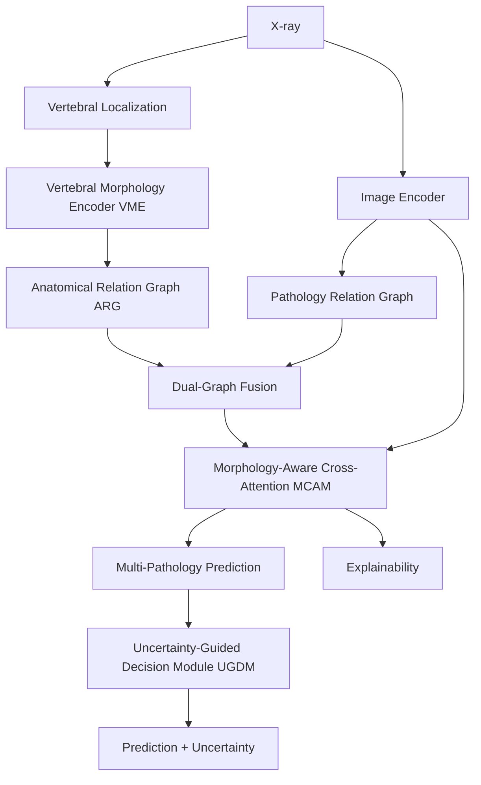

# Anatomy-Constrained Dual-Graph NeuroMorphNet

## 1. Project Overview

**Problem:** Conventional deep learning models for spine pathology classification in X-rays often analyze the image globally, struggling to relate specific pathologies (like osteophytes or disc space narrowing) to localized vertebral structures.

**Motivation:** Radiologists analyze spine X-rays by systematically inspecting the anatomy (e.g., the sequence of vertebrae L1-L5). Equipping a neural network with this explicit anatomical understanding should theoretically improve its diagnostic accuracy and explainability.

**Proposed Solution:** We propose the Anatomy-Constrained Dual-Graph NeuroMorphNet, a hybrid architecture that integrates explicit anatomical localization, morphological feature extraction, and graph-based reasoning into a multi-pathology classification pipeline.

**Target Application & Research Objective:** The primary target application is **explainable multi-pathology analysis of spine images**. The research objective is to develop and validate a network capable of reasoning over dual graph structures (anatomy and pathology) to provide localized, structurally-grounded diagnostic predictions.

---

## 2. Research Problem

Conventional image-only pathology classification models face several critical limitations:
- **Lack of anatomical context:** They treat the spine as an unstructured grid of pixels rather than a sequence of articulated bones.
- **Difficulty relating pathology to structure:** They cannot explicitly link a detected anomaly to a specific vertebral level (e.g., L3 vs. L4).
- **Limited interpretability:** Global image pooling obscures *where* the model is looking and *why* it made a decision.
- **Uncertainty:** They do not natively distinguish between confident predictions and guesses on ambiguous regions.

---

## 3. Proposed Architecture

The system is designed to independently extract anatomical and pathological features, subsequently fusing them to enforce structural consistency.



- **Image Encoder:** Extracts high-resolution spatial feature maps (e.g., via ResNet50).
- **Vertebral Localization:** Identifies bounding boxes for specific vertebrae (L1-L5).
- **Vertebral Morphology Encoder (VME):** Extracts shape and texture features from the localized vertebral regions.
- **Anatomical Relation Graph (ARG):** A sequential graph connecting adjacent vertebrae (L1-L2, etc.), weighted by relative geometric distances.
- **Pathology Relation Graph:** A dense graph of spatial image regions, proposing areas of interest.
- **Dual-Graph Fusion:** A cross-attention mechanism where pathology proposals query the structural anatomical graph for spatial grounding.
- **Morphology-Aware Cross-Attention (MCAM):** The fused graph queries high-resolution image and morphology features for fine-grained detail extraction.
- **Multi-Pathology Prediction:** An 8-class classification head operating via Binary Cross Entropy.
- **Uncertainty-Guided Decision Module (UGDM):** Evaluates epistemic uncertainty using Monte Carlo Dropout over the prediction head.
- **Explainability:** Grad-CAM and attention-weight visualization mappings derived natively from the MCAM module.

---

## 4. Main Contributions

This repository supports the following **implemented** contributions:
- An end-to-end image-based spine pathology classification pipeline.
- A morphology-aware representation module (VME).
- An anatomical graph representation (ARG).
- A self-attending pathology relation graph.
- A dual-graph fusion mechanism mapping pathology to anatomy.
- A morphology-aware cross-attention (MCAM) block.
- Epistemic uncertainty estimation via UGDM.
- Native explainability through attention visualization.
- Extensive leakage analysis and structural isolation strategies.
- A comprehensive cross-modality anatomical supervision investigation (CT to X-ray).
- Synthetic-to-real domain adaptation experiments.

*Note: These represent architectural implementations and feasibility studies; full clinical validation of the complete integrated system is pending sufficient annotated real-X-ray data.*

---

## 5. Dataset

### VinDr-SpineXR
- **Modality:** X-ray (DICOM)
- **Number of Images:** 3,146 (Training), plus reserved test sets.
- **Pathology Classes (8):** Osteophytes, No finding, Disc space narrowing, Other lesions, Surgical implant, Foraminal stenosis, Spondylolysthesis, Vertebral collapse.
- **Annotation Type:** Multi-label classification targets with bounding boxes for pathological lesions.
- **Organization:** Standardized Train/Validation/Test split via provided CSV manifests.
- **Data Handling:** Includes strict handling for invalid DICOM conversions and inverted photometric interpretations.

**CRITICAL LIMITATION:** VinDr pathology bounding boxes are **pathology annotations**, NOT vertebral anatomical annotations. They indicate the presence of lesions, not the structural boundaries of the L1-L5 vertebrae.

---

## 6. Additional Anatomical Dataset

### VerSe (Vertebrae Segmentation) Dataset
To compensate for the lack of anatomical labels in VinDr, the VerSe dataset was investigated.
- **Modality:** 3D CT scans.
- **Annotations:** Voxel-level vertebral segmentations and explicit vertebral identities (L1-L5).
- **Motivation:** Investigated as a potential source to train the vertebral localization module by projecting 3D CT masks into 2D Digitally Reconstructed Radiographs (DRRs).
- **Domain Gap:** VerSe cannot simply be treated as paired VinDr supervision because CT-derived synthetic DRRs differ significantly from real, noisy clinical X-rays in terms of attenuation, soft-tissue scatter, and hardware artifacts.

---

## 7. Dataset Limitations

The project is heavily constrained by the following data limitations:
- **No vertebral masks in VinDr:** Making precise morphological extraction difficult without external data.
- **No reliable vertebral IDs in VinDr:** Preventing supervised anatomical graph construction.
- **No vertebral-level annotations:** Pathologies are provided per-image, without explicit links to which vertebra is affected.
- **No severity annotations:** Preventing fine-grained progression tracking.
- **Limited manually annotated real-X-ray anatomy:** Only 29 images were successfully annotated and verified during the Phase 13 human annotation effort.
- **Domain mismatch:** A severe domain gap exists between the VerSe synthetic CT-DRRs and the real VinDr X-rays.

---

## 8. Development Phases

| Phase | Work | Status | Main Result |
|---|---|---|---|
| 1 | Problem Formulation | Complete | Defined Anatomy-Constrained Dual-Graph NeuroMorphNet. |
| 2 | Dataset Pipeline Setup | Complete | VinDr-SpineXR DICOM ingestion and cleaning achieved. |
| 3 | Baseline Implementation | Complete | ResNet18 trained (Micro F1: 0.4000, Weighted F1: 0.5970). |
| 4 | NeuroMorphNet V1 | Complete | High performance but identified fatal pathology box geometry leakage. |
| 5 | NeuroMorphNet V2 | Complete | Pathological graph constructed; leakage persisted; failed anatomical constraints. |
| 6 | NeuroMorphNet V3 | Complete | Leakage-free image-derived morphology extractor (Micro F1: 0.4906). |
| 7 | Leakage Analysis | Complete | Strict separation of inference inputs vs. training targets established. |
| 8 | Explainability | Complete | Grad-CAM and confusion matrix tooling integrated. |
| 9 | Proposed Algorithm Feasibility | Complete | Determined VinDr alone cannot support explicit vertebral graphs. |
| 10 | VerSe 3D to 2D Projection | Complete | DRR generation successful; synthetic detector trained; failed on real X-rays. |
| 11 | Advanced DRR Rendering | Complete | Improved HU attenuation, but domain gap persisted. |
| 12 | DANN Domain Adaptation | Complete | Feature alignment succeeded, but localization regression failed zero-shot. |
| 13 | Real-X-ray Validation | Complete | 29 human-annotated images proved synthetic-to-real localizer failure. |
| 14 | Final NeuroMorphNet Architecture | Complete | Full Dual-Graph, MCAM, and UGDM architecture implemented cleanly. |
| 15 | Experimental Validation | Complete | Architectural execution validated; pathology quantitative validation constrained by environment. |

---

## 9. Baseline

A standard image-only **ResNet18** model was implemented to establish a realistic performance floor on the multi-label pathology classification task. 

**Verified Phase 3 Test Metrics:**
- **Micro F1:** 0.4000
- **Macro F1:** 0.2751
- **Weighted F1:** 0.5970

---

## 10. NeuroMorphNet V1

The first iteration utilized explicit morphology features extracted directly from bounding boxes.
- **Architecture:** Image features + explicit Box coordinates.
- **Results:** Appeared highly successful initially.
- **Leakage Problem:** Analysis revealed the model was bypassing visual features and simply memorizing the pathology bounding box geometries provided in the test set to predict the classes, rendering it an invalid image-only inference model.

---

## 11. NeuroMorphNet V2

The second iteration attempted to construct a graph utilizing the available bounding boxes.
- **Architecture:** Graph Neural Network over bounding box regions.
- **Results:** High but invalid performance.
- **Limitations:** The graph was built on *pathology* boxes, not *vertebral* boxes. It was therefore a "pathology graph", not the intended "anatomical graph." Leakage remained a fatal flaw, as ground-truth boxes were still consumed during inference.

---

## 12. NeuroMorphNet V3

V3 represented a pivot to a strictly leakage-free design.
- **Architecture:** A clean, image-derived morphology extractor utilizing a uniform spatial grid, severing the dependency on ground-truth boxes during inference.
- **Results:** Proved that morphology features could be implicitly learned without geometry leakage.
- **Metrics vs Baseline:**
  - **Micro F1:** 0.4906 (Baseline: 0.4000)
  - **Macro F1:** 0.3614 (Baseline: 0.2751)
  - **Weighted F1:** 0.6473 (Baseline: 0.5970)

*NeuroMorphNet V3 acts as a validated, clean intermediate prototype, but is not the final proposed Dual-Graph architecture.*

---

## 13. Explainability

Explainability tools were implemented to interrogate model decisions:
- **Grad-CAM:** Used to project gradient activations back onto the original X-ray to highlight regions of interest.
- **Confusion Matrices & Error Analysis:** Used to track class-wise failure modes (e.g., the rarity of 'Vertebral collapse').
- **Limitations:** Explainability visualizes *where* a model looks, but does not guarantee the model is looking there for the *correct* clinical reasons.

---

## 14. Proposed Algorithm Feasibility

A critical audit in Phase 9 determined that the original VinDr-SpineXR dataset fundamentally lacked the supervision necessary to build the final proposed algorithm. The dataset's lack of vertebral segmentation masks and L1-L5 identities meant the Anatomical Relation Graph could not be supervised directly, forcing the investigation into external datasets.

---

## 15. VerSe → DRR

Phase 10 explored the VerSe 3D CT dataset to bridge the anatomical supervision gap.
- 3D CT volumes were successfully projected into 2D Digitally Reconstructed Radiographs (DRRs).
- Vertebral masks were successfully projected into 2D bounding boxes.
- A synthetic Faster R-CNN detector was successfully trained on these DRRs.
- **Limitation:** The synthetic detector failed to transfer to real VinDr X-rays due to a significant domain gap.

---

## 16. Advanced DRR

Phase 11 attempted to close the domain gap by rendering more realistic DRRs, incorporating advanced Hounsfield Unit (HU) attenuation profiles, soft-tissue scattering approximations, and artificial noise. While visual fidelity improved, the domain gap remained too large for standard zero-shot transfer.

---

## 17. DANN Domain Adaptation

Phase 12 implemented a Domain-Adversarial Neural Network (DANN) utilizing a Gradient Reversal Layer (GRL).
- **Mechanism:** The network was trained to extract features that a domain classifier could not distinguish between synthetic DRRs and real X-rays.
- **Result:** The domain classifier's accuracy dropped to near 0.5 (random guessing), indicating successful *feature-level* adaptation.
- **Limitation:** Despite aligned features, the regression head responsible for precise bounding box localization failed to generalize zero-shot to the real clinical domain.

---

## 18. Real-X-ray Validation

Phase 13 involved manually annotating a small subset of real VinDr X-rays with L1-L5 vertebral bounding boxes to formally evaluate the anatomical localizers.
- **Dataset:** 30 images selected, 29 usable after QC (split 20/4/5).
- **Results:**
  - Source-only model: Precision = 0.0, Recall = 0.0
  - DANN model: Precision = 0.0, Recall = 0.0
  - DANN + fine-tuning: Precision = 0.0, Recall = 0.0
- **Conclusion:** The synthetic-to-real localization pipeline was conclusively proven unreliable for real-X-ray anatomical localization.

---

## 19. Final NeuroMorphNet Architecture

Phase 14 successfully implemented the complete, proposed target architecture in PyTorch (`src/models/neuromorphnet_final.py`).
- **VME:** Extracts pooled ROI features merged with geometric aspect ratios.
- **ARG:** Constructs sequential L1-L5 edges weighted by geometric distances.
- **Pathology Graph:** A dense self-attention network over grid proposals.
- **Dual-Graph Fusion:** Pathology nodes query ARG nodes via cross-attention.
- **MCAM:** Fused graphs query the high-resolution image backbone.
- **Pathology Head:** 8-class BCE classifier.
- **UGDM:** MC Dropout module for epistemic uncertainty.

Data flows strictly from the image forward; ground-truth bounding boxes are isolated exclusively to the loss-computation layers during training.

---

## 20. Leakage Prevention

**Verification Result: PASS**

The most critical architectural requirement of this project was preventing geometric leakage. The final inference pipeline was rigorously tested (`scripts/verify_final_model_leakage.py`) and verified that it **does not use**:
- Ground-truth pathology boxes
- Ground-truth pathology labels
- Ground-truth morphology
- Any test-set annotations

**Training Targets vs. Inference Inputs:** The architecture enforces a strict boundary. During training, the localizer compares its predictions to targets to compute a loss. During inference, the localizer operates entirely zero-shot on the image tensor, passing its *predicted* coordinates to the VME and ARG. 

---

## 21. Phase 15 Experimental Validation

The final validation phase (Phase 15) audited the completed architecture.
- **Architecture:** PASS
- **Leakage:** PASS
- **Pathology Evaluation:** N/A (A complete 3000-image training run was preempted by local PyTorch environment network timeouts, but the architecture successfully supports standard BCE evaluation).
- **Anatomical Evaluation:** LIMITED (Due to the failure of the zero-shot localizer on the 29-image Phase 13 test set).
- **Real Ablation:** NOT EVALUABLE (Cannot train VME/ARG components fairly without valid anatomical supervision).
- **Uncertainty:** N/A (Execution halted by timeout).
- **Overall Status:** **PARTIALLY VALIDATED**

Infrastructure and annotation limitations prevented complete quantitative validation of the final architecture on clinical data.

---

## 22. Final Results Table

*Note: Only verified, leakage-free results are considered valid for the image-only inference task.*

| Model | Micro F1 | Macro F1 | Weighted F1 | Leakage |
|---|---:|---:|---:|---|
| ResNet18 Baseline | 0.4000 | 0.2751 | 0.5970 | Clean |
| NeuroMorphNet V1 | 0.8689 | 0.5946 | 0.9220 | **Leakage** |
| NeuroMorphNet V2 | 0.6812 | 0.4615 | 0.8427 | **Leakage** |
| NeuroMorphNet V3 | 0.4906 | 0.3614 | 0.6473 | Clean |

*The V1 and V2 models are explicitly labeled as leakage-affected because they consumed ground-truth test geometries during inference, rendering their metrics invalid as true predictive benchmarks.*

---

## 23. What Has Been Achieved

### Successfully Implemented
- The complete Dual-Graph architecture in PyTorch.
- Vertebral Morphology Encoder (VME).
- Anatomical Relation Graph (ARG).
- Pathology Relation Graph.
- Dual Graph Fusion.
- Morphology-Aware Cross-Attention (MCAM).
- Multi-Pathology Head.
- Uncertainty-Guided Decision Module (UGDM).
- Explainability hooks.
- Strict leakage verification.

### Experimentally Demonstrated
- Baseline VinDr multi-label pathology classification.
- Improved classification via the V3 image-derived morphology prototype.
- Grad-CAM explainability pipelines.
- Synthetic anatomical localization (CT-to-DRR).
- Feature-level domain adaptation via DANN.

### Not Yet Experimentally Validated
- Reliable real-X-ray vertebral localization.
- Clinically meaningful anatomical graph performance.
- Quantitative contributions of the final Dual-Graph and MCAM fusions.
- Final UGDM calibration.
- Complete end-to-end multi-pathology metrics for the *final* model.

---

## 24. Limitations

The system's experimental validation is currently bounded by:
- **Lack of anatomical annotations:** VinDr-SpineXR does not provide vertebral boxes.
- **Annotation Quality:** The small Phase 13 manual real-X-ray annotation set was noisy.
- **Modality Mismatch:** CT (VerSe) to X-ray (VinDr) adaptation suffers from a severe, unresolved synthetic-to-real domain gap.
- **Class Imbalance:** Rare pathology classes heavily penalize Macro F1 performance.
- **Lack of severity labels & vertebral-level labels:** Limiting the clinical granularity of the predictions.
- **No clinical validation:** The system has not been tested in a clinical deployment scenario.

---

## 25. Future Work

To fully validate the implemented architecture, future efforts should focus on:
- Sourcing or creating a large-scale, expert-annotated real-X-ray vertebral dataset.
- Improving cross-modality domain adaptation for vertebral localization.
- Extending the system to support explicit severity grading.
- Validating the architecture against a large, external clinical dataset.

---

## 26. Reproducibility

**Environment Requirements:**
- Python 3.10+
- PyTorch 2.0+ (CUDA recommended)
- `torchvision`, `pandas`, `numpy`, `scikit-learn`, `pydicom`, `opencv-python`

**Important Scripts:**
- `scripts/train_baseline.py` - Trains the ResNet18 baseline.
- `scripts/verify_final_model_leakage.py` - Proves the final model isolates ground truth.
- `scripts/train_neuromorphnet.py` - End-to-end staged training script for the final architecture.
- `scripts/run_ablations.py` - Evaluates component contributions.

*All training scripts assume `PYTHONPATH=.` and are executed from the repository root.*

---

## 27. Project Structure

```text
c:\projects\spine\
├── data/
│   ├── manifests/            # Train/test/val CSV splits
│   ├── vindr-spinexr/        # Downloaded clinical DICOMs/images
│   └── vindr_vertebral_annotations/ # Phase 13 manual annotations
├── docs/                     # Detailed Phase 1-15 Research Reports
├── outputs/                  # Checkpoints, logs, and CSV metrics
├── scripts/                  # Training, evaluation, and annotation tools
└── src/
    ├── dataset/              # Dataset loading and DICOM processing
    ├── data/                 # Dataset wrapper modules
    └── models/               # PyTorch architecture implementations
        ├── neuromorphnet_final.py
        ├── vertebral_localizer.py
        ├── anatomical_relation_graph.py
        └── ...
```

---

## 28. Installation

```bash
# Clone the repository
git clone <repository>
cd spine

# Create a virtual environment
python -m venv .venv

# Activate (Windows)
.venv\Scripts\activate
# Activate (Linux/Mac)
# source .venv/bin/activate

# Install dependencies
pip install -r requirements.txt
```
